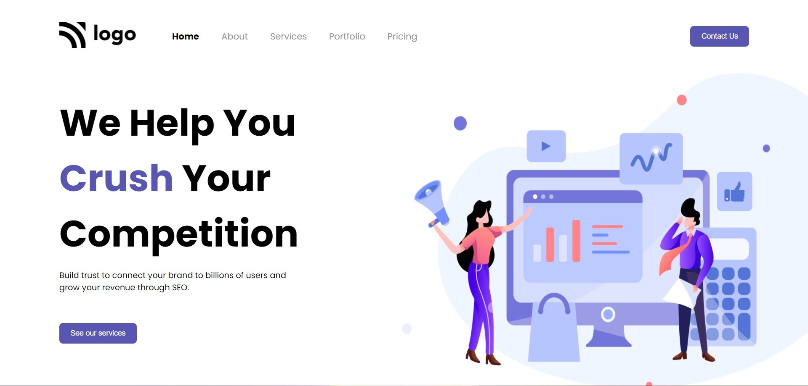

# Project 4 - HTML  and CSS 

By Shubham

Here's the Live Deployed Website 

[DEPLOYED WEBSITE LINK](https://crushcompetition.netlify.app//)

## What I learned from this Project?

- I learned about **layout** making around the webpage.
- I also learned how to add use **Illustrations** to make your website **beautiful**.
- I also learned how to add diffrent fonts from the **Google Fonts**
- I also learned how to design **Buttons** and **Beautiful Navbar**.

## This project took around **3 hours** to complete.
